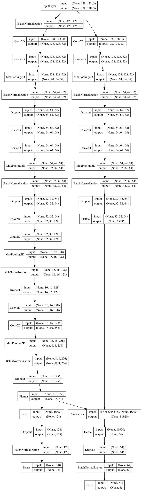

# planet-amazon-satellite-image
Convolutional Neural Network for multiclass and multilabel classification (Kaggle's competition)
- multi-class (4 class for "cloud condition"): each image only have 1 cloud condition
- milti-label (9 labels about human footprint): each image can have 0 - 9 labels

## Content
- `batch_img_gen.py`: A custom batch image data/label generator with options to perform image augmentation. It can be called infinite number of times for model training.
- `planet_amazon_clf.py`: custom classes containing building blocks for building various neural network architectures for this problem.

## Example architectures:

